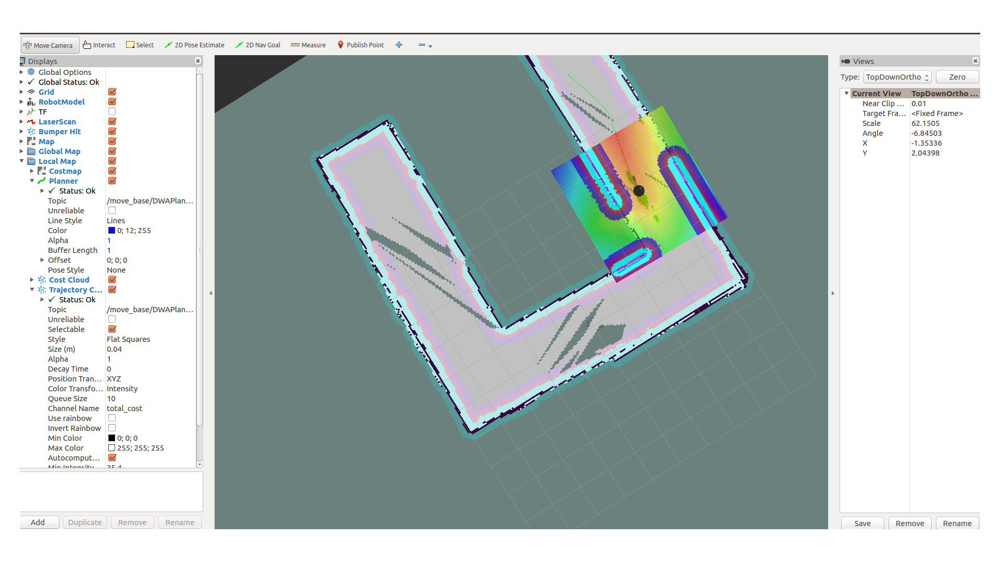
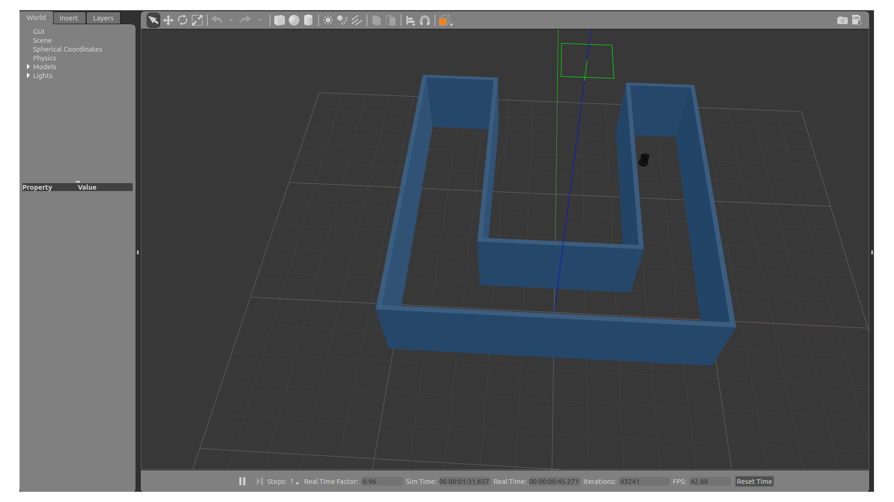

# RoboND-Home-Service-Robot

Home service robot as part of my Udacity Robotics Nanodegree.




This proect is to be built from scratch for a home service robot with the following steps:

1. Build a Home/hallway-like environment in Gazebo/
2. Build a map of the environment using gmapping and teleoperation.
3. Use the ROS AMCL library to detect the robot position within the known map.
4. Use the move_base library and the simple action client to plot a path to a target pose and navigate to it.
5. Implement a node to wrap the path planning and driving libraries and listen for goal poses.
6. Implement a node to publish goal poses for the robot, then compare these to the actual pose (odometry topic) to determine success.

# Installation

You should have a ROS catkin_ws already setup on your Linux workspace computer.

```shell
$ cd ~
$ git clone https://github.com/Amay22/RoboND-Home-Service-Robot.git
$ cp RoboND-Home-Service-Robot/* ~/catkin_ws/src/
$ cd ~/catkin_ws
$ catkin_make
$ source devel/setup.bash
$ sudo chmod +x src/ShellScripts/*.sh

```

# Run

You can run the Home Service Bot from the catkin_ws:

```shell
$ cd ~/catkin_ws
$ ./src/ShellScripts/home_service.sh
```

